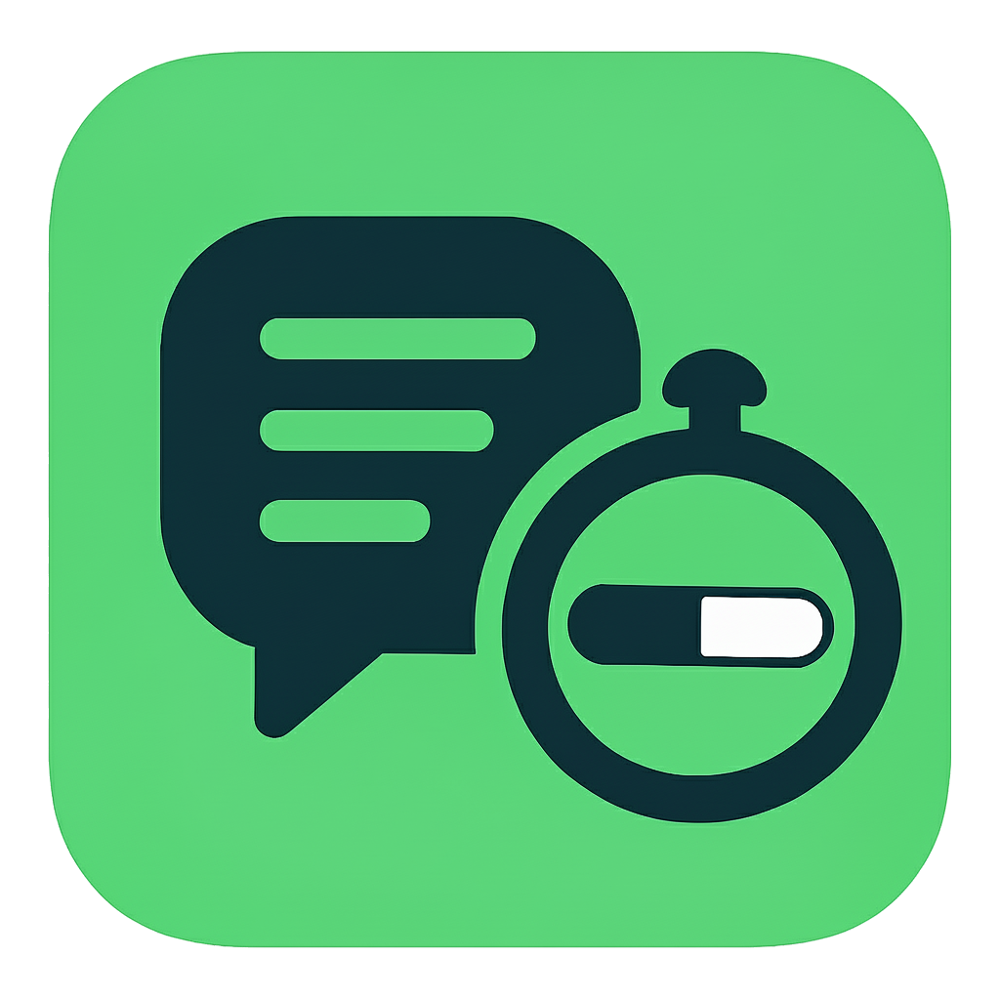

<div align="center">
  
  <h1>Context Reminder</h1>
  <p><strong>Never lose context in your AI conversations again!</strong></p>
  <p>A VS Code extension that monitors your prompt size and warns you when approaching Claude or GPT context limits.</p>

  <p>
    <a href="https://marketplace.visualstudio.com/items?itemName=robsonalvesdevbr.context-reminder">
      
    </a>
    <a href="https://github.com/robsonalvesdevbr/context-reminder/blob/main/LICENSE">
      
    </a>
    <a href="https://github.com/robsonalvesdevbr/context-reminder">
      
    </a>
  </p>
</div>

## ✨ Features

<table>
<tr>
<td>🚨</td>
<td><strong>Smart Alerts</strong><br/>Automatic warnings when tokens exceed limits</td>
</tr>
<tr>
<td>🤖</td>
<td><strong>Multi-Model Support</strong><br/>Support for Claude and GPT with specific token counting</td>
</tr>
<tr>
<td>⚙️</td>
<td><strong>Configurable</strong><br/>Adjust limits and models in VS Code Settings</td>
</tr>
<tr>
<td>🔄</td>
<td><strong>Real-Time</strong><br/>Continuous monitoring while you type</td>
</tr>
<tr>
<td>🎯</td>
<td><strong>Non-Intrusive</strong><br/>Works silently until you need to be warned</td>
</tr>
</table>

## 🚀 Installation

### Method 1: VS Code Marketplace
```bash
ext install robsonalvesdevbr.context-reminder
```

### Method 2: VS Code Interface
1. Open VS Code
2. Go to Extensions (`Ctrl+Shift+X` / `Cmd+Shift+X`)
3. Search for "Context Reminder"
4. Click **Install**

<div align="center">
  <a href="https://marketplace.visualstudio.com/items?itemName=robsonalvesdevbr.context-reminder">
    
  </a>
</div>

## ⚙️ Configuration

Access `File → Preferences → Settings` and search for "Context Reminder":

| Setting | Description | Default | Options |
|---------|-------------|---------|----------|
| **Model** | AI model for token counting | `claude` | `claude`, `gpt` |
| **Token Limit** | Threshold for showing alerts | `2000` | Any positive number |

## 📖 How to Use

1. **Automatic Activation** - Extension activates automatically when VS Code starts
2. **Work Normally** - Continue working on your files as usual
3. **Receive Alerts** - When exceeding the limit, you'll see: "⚠️ Your prompt has X tokens (limit: Y). Consider starting a new chat!"
4. **Adjust as Needed** - Change settings in VS Code Settings

## 🎯 Use Cases

<div>
<details>
<summary><strong>🤖 AI Prompts</strong></summary>
<p>Prevent context loss in long conversations with Claude/GPT</p>
</details>

<details>
<summary><strong>📚 Technical Documentation</strong></summary>
<p>Monitor size before sending to AI for analysis</p>
</details>

<details>
<summary><strong>🔍 Code Reviews</strong></summary>
<p>Know if code fits within the model's context window</p>
</details>

<details>
<summary><strong>📊 Log Analysis</strong></summary>
<p>Verify logs are small enough for AI processing</p>
</details>
</div>

## 💡 Tips

> **💡 Pro Tip:** Different models have different context limits - adjust accordingly!

- **Different Models** - Claude and GPT have different context limits, adjust to your needs
- **Long Documents** - Use the extension to break large documents into smaller parts
- **Development** - Monitor scripts and code before requesting AI analysis

## 📋 Changelog

See all changes and new features in [CHANGELOG.md](CHANGELOG.md).

### Recent Updates - v0.1.0
```
🐛 CRITICAL FIX: Commands now work via Command Palette
✨ esbuild bundling system - all dependencies included
🚀 Extension fully functional - no more "Cannot find module" errors
⚡ Optimized build process with minification
🔧 Debug logging for better troubleshooting
📦 Package size increased to 3.19MB (includes all dependencies)
🎯 activationEvents fixed for manual command execution
```

## 🤝 Contributing

Interested in contributing? Check our [Contributing Guide](CONTRIBUTING.md) for developers.

<div align="center">
  <a href="CONTRIBUTING.md">
    
  </a>
</div>

## 📝 License

This project is licensed under the **MIT License** - a permissive license that allows commercial use and modifications.

**MIT License Summary:**
- ✅ **Commercial use** allowed
- ✅ **Modification** allowed
- ✅ **Distribution** allowed
- ✅ **Private use** allowed
- ❗ **No warranties** - software provided "as is"

See the [LICENSE](LICENSE) file for complete details.

## 👨‍💻 Author

<div align="center">
  
  <h3>Robson Candido dos Santos Alves</h3>
  <p>
    <a href="https://github.com/robsonalvesdevbr">
      
    </a>
    <a href="mailto:robson.curitibapr@gmail.com">
      
    </a>
  </p>
</div>

---

<div align="center">
  <h3>⭐ Enjoyed the extension?</h3>
  <p>Star the repository and share with others!</p>
  <a href="https://github.com/robsonalvesdevbr/context-reminder">
    
  </a>
</div>